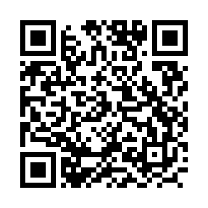

# 院内コール当直トレーニング

初期研修医(1〜2年目)向けの、夜間当直中に看護師からかかってくる院内コールを疑似体験できるトレーニングアプリです。

## 公開ページ

**https://namazu1995-coder.github.io/hospital-oncall-training/**



スマートフォンで上記QRコードを読み取ると、そのままアプリを開けます。

## このアプリについて

夜間、看護師から電話がかかってきた場面を想定した8症例(緊急性の高いコール5例、判断力が問われるコール3例)を収録しています。

各症例では、模範解答を見る前に

1. 電話でまず確認すること
2. 見落とすと危険な病態
3. 初期対応・指示

を自分の言葉で書き出してから、具体的な薬剤量・プロトコルを含む模範解答と「症例のまとめ」、実在のガイドライン・論文の参考文献を確認できます。訪室の要否を判断する「🚨 直ちに訪室」「☎ 電話評価のうえ判断」のバッジも表示され、コール対応特有の緊急度判断力を鍛えられます。

進捗はブラウザのlocalStorageに保存され、自己評価に応じて復習リストが作成されます。

## 収録症例

**緊急性の高いコール**
- 胸痛(ステント血栓症・再梗塞の疑い)
- 呼吸苦・SpO2低下(肺血栓塞栓症の疑い)
- 意識レベル低下(低血糖による意識障害)
- 血圧低下・頻脈(消化管出血の再出血によるショック)
- 転倒(抗凝固薬内服中の頭部外傷)

**判断力が問われるコール**
- せん妄・不穏(術後せん妄)
- 乏尿・尿量低下(体液過剰を伴う乏尿)
- 不眠時指示(不眠の背景検索と睡眠薬適正使用)

## 編集方法

`index.html` 1ファイルで完結するVanilla JSアプリです。クローンして編集し、`main`ブランチにpushするとGitHub Pagesへ自動反映されます。

```bash
git clone https://github.com/namazu1995-coder/hospital-oncall-training.git
```
